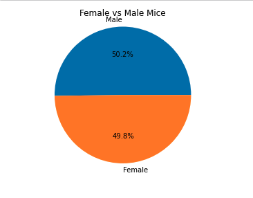
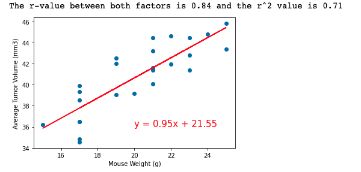
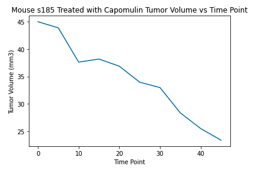
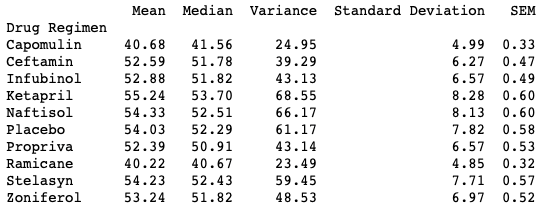
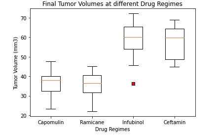

# Pymaceuticals
Analysis of pharmaceutical Data using Matplotlib

## Project Description

The goal of the project is to compare the performance of the drug, Capomulin, versus the other treatment regimens. `Python`, `Matplotlib` library, `Pandas` library, and `scipy` library were used in the project. The data was imported from csvs using `Pandas` and the data was cleaned and then plotted using `Matplotlib`.

## Background

249 mice identified with SCC tumor growth were treated through a variety of drug regimens. Over the course of 45 days, tumor development was observed and measured. The data used can be found in the following csv files: [Mouse Metadata](https://github.com/lisb020/Pymaceuticals/blob/main/Pymaceuticals/data/Mouse_metadata.csv) and [Study Results](https://github.com/lisb020/Pymaceuticals/blob/main/Pymaceuticals/data/Study_results.csv)

## Observations and Insights

- The gender of the mice is very uniform and almost identical. Also, the amount of mice per drug regimen is similar.

- The scatter plot demonstrates for Capomulin that the mouse weight and tumor volume possitively correlated and the tumor volume was larger for larger mice.

- The line plot demonstrates that Capomulin decreases the tumor volume over time.

- Capomulin is as effective as the most effective drug at reducing tumors as shown in the boxplot and summary statistics table where the tumor volume mean and median are almost as low as the lowest median and mean, Ramicane.

## Libraries Required

- Matplotlib
- Pandas
- Scipy

## File Description

### Pymaceuticals

- Main folder

#### pymaceuticals_code.ipynb

- Contains the code in a jupyter notebook file.

### Data

- This folder contains two csv files that are the data imported into the jupyter notebook file.

### images

- This folder contains screenshots of the jupyter notebook graphs.
